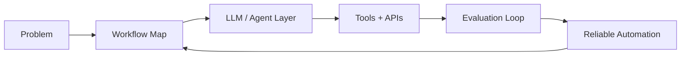

<div align="center">


[](https://git.io/typing-svg)

[](https://github.com/DagogoGrant)
[](https://github.com/DagogoGrant)
[](#)
[](#)

</div>

## About Me

- Master's student in AI Engineering, focused on practical AI systems.
- Building with LLM applications, agentic workflows, RAG, and workflow automation.
- Interested in production AI engineering roles across Germany and remote Europe.
- I like systems where models use tools, retrieve context, and produce measurable outcomes.

## System Profile

```txt
Role        AI Engineering Master's Student
Location    Germany / Europe
Focus       LLM apps, RAG, AI agents, workflow automation
Mode        Build useful systems, ship iteratively, measure behavior
```

## Technologies I Use

<div align="center">


</div>

## Interactive Map



<details open>
<summary><b>Current Build Stack</b></summary>

```txt
Languages      Python, TypeScript, SQL
AI / LLMs      OpenAI API, LangChain, LangGraph, RAG, tool calling, evals
Backend        FastAPI, REST APIs, PostgreSQL
Infra          Docker, CI/CD, cloud platforms
Data           Vector databases, embeddings, model monitoring
```

</details>

<details>
<summary><b>What I am building toward</b></summary>

- AI agents that can use tools, retrieve context, and complete structured tasks.
- RAG systems with evaluation loops instead of one-off prompt experiments.
- Workflow automations with clean APIs and measurable outputs.
- Production AI engineering roles in Germany and remote Europe.

</details>

<details>
<summary><b>Keywords recruiters and collaborators should find here</b></summary>

`Python` `LLM Applications` `RAG` `Vector Databases` `LangChain` `LangGraph`
`AI Agents` `Tool Calling` `Workflow Automation` `Prompt Engineering`
`Evaluation Frameworks` `FastAPI` `APIs` `Docker` `PostgreSQL`

</details>

## Featured Workbench

| Track | What I build | Stack signal |
|---|---|---|
| Agentic systems | Tool-using agents, workflow copilots, task automation | Python, LangGraph, APIs |
| RAG apps | Retrieval pipelines, embeddings, evaluation loops | Vector DBs, FastAPI, OpenAI API |
| Automation | Repetitive process automation with reliable outputs | Docker, CI/CD, PostgreSQL |
| AI product engineering | Practical interfaces around model-powered workflows | TypeScript, APIs, observability |

## Live Dashboard

<div align="center">


</div>

## Trophies

<div align="center">


</div>

## Contribution Loop

<div align="center">


</div>

## Connect

<div align="center">

[](https://github.com/DagogoGrant)
[](#)

</div>

---

<div align="center">

**Building AI systems that do the work, not just describe it.**


</div>
