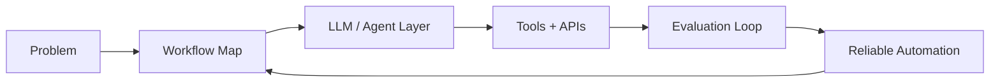

<div align="center">


[](https://git.io/typing-svg)

[](https://github.com/DagogoGrant)
[](https://github.com/DagogoGrant)
[](#)

</div>

## System Profile

```txt
Role        AI Engineering Master's Student
Location    Germany / Europe
Focus       LLM apps, RAG, AI agents, workflow automation
Mode        Build useful systems, ship iteratively, measure behavior
```

I work on AI systems that are useful beyond demos: retrieval pipelines, agentic workflows,
automation tools, API integrations, and production-minded LLM applications.

## Interactive Map



<details open>
<summary><b>Current Build Stack</b></summary>

```txt
Languages      Python, TypeScript, SQL
AI / LLMs      OpenAI API, LangChain, LangGraph, RAG, tool calling, evals
Backend        FastAPI, REST APIs, PostgreSQL
Infra          Docker, CI/CD, cloud platforms
Data           Vector databases, embeddings, model monitoring
```

</details>

<details>
<summary><b>What I am building toward</b></summary>

- AI agents that can use tools, retrieve context, and complete structured tasks.
- RAG systems with evaluation loops instead of one-off prompt experiments.
- Workflow automations with clean APIs and measurable outputs.
- Production AI engineering roles in Germany and remote Europe.

</details>

<details>
<summary><b>Keywords recruiters and collaborators should find here</b></summary>

`Python` `LLM Applications` `RAG` `Vector Databases` `LangChain` `LangGraph`
`AI Agents` `Tool Calling` `Workflow Automation` `Prompt Engineering`
`Evaluation Frameworks` `FastAPI` `APIs` `Docker` `PostgreSQL`

</details>

## Live Dashboard

<div align="center">


</div>

## Contribution Loop

<div align="center">


</div>

---

<div align="center">

**Building AI systems that do the work, not just describe it.**


</div>
