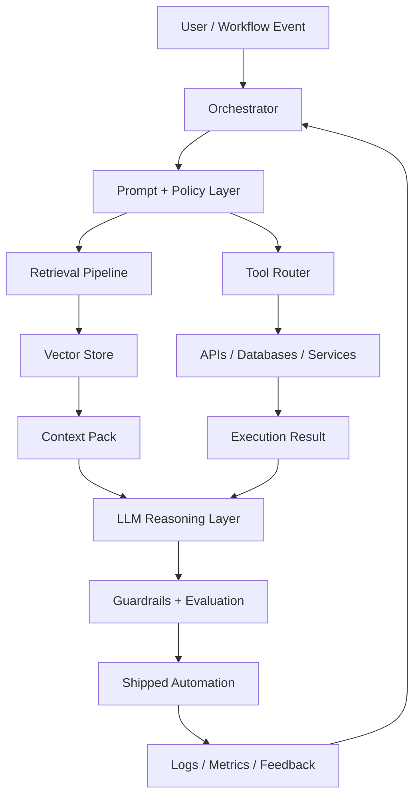

<div align="center">


[](https://git.io/typing-svg)

[](https://github.com/DagogoGrant)
[](https://github.com/DagogoGrant)
[](#)
[](#)

</div>

```txt
grant@github:~$ whoami
AI Engineering Master's student building practical LLM systems, RAG apps, tool-using agents,
and automation workflows that move from prompt experiments toward reliable production behavior.

grant@github:~$ current_vector
Germany / Europe :: AI automation :: agentic workflows :: production LLM applications
```

## Runtime Profile

| Layer | Signal |
|---|---|
| Identity | AI Engineering Master's student focused on applied systems |
| Core domain | LLM apps, RAG, AI agents, workflow automation |
| Engineering mode | Prototype fast, evaluate behavior, harden useful flows |
| Target surface | Backend services, internal tools, workflow copilots, automation dashboards |
| Direction | Production AI engineering roles in Germany and remote Europe |

## Agentic Architecture



## Tech Control Plane

<div align="center">


</div>

```txt
languages       Python, TypeScript, SQL
llm_stack       OpenAI API, LangChain, LangGraph, tool calling, structured outputs
retrieval       embeddings, vector search, context compression, reranking patterns
backend         FastAPI, REST APIs, PostgreSQL, async services
delivery        Docker, CI/CD, GitHub Actions, cloud-ready services
quality         eval sets, LLM-as-judge patterns, traces, monitoring, guardrails
```

## Build Matrix

| System | What it should do | Engineering concern |
|---|---|---|
| Agent runtime | Plan steps, call tools, use context, return structured output | State, retries, tool safety |
| RAG service | Retrieve useful evidence before generation | Chunking, embeddings, relevance, evals |
| Workflow automation | Replace repetitive manual processes with API-driven flows | Reliability, observability, fallbacks |
| AI backend | Serve model-powered features through clean interfaces | Latency, validation, cost control |
| Evaluation loop | Measure whether outputs improve over time | Test sets, scoring, regression tracking |

<details open>
<summary><b>Currently Indexing</b></summary>

- Agent orchestration with LangGraph-style state machines.
- RAG pipelines that separate retrieval quality from generation quality.
- FastAPI services around model calls, tools, and automation triggers.
- Evals, traces, and feedback loops for production AI behavior.

</details>

<details>
<summary><b>Recruiter Search Terms</b></summary>

`Python` `LLM Applications` `RAG` `Vector Databases` `LangChain` `LangGraph`
`AI Agents` `Tool Calling` `Workflow Automation` `Prompt Engineering`
`Evaluation Frameworks` `FastAPI` `APIs` `Docker` `PostgreSQL`
`Model Monitoring` `Guardrails` `Production AI Systems`

</details>

## Telemetry

<div align="center">


</div>

## Achievement Layer

<div align="center">


</div>

## Contribution Loop

<div align="center">


</div>

## Connect

<div align="center">

[](https://github.com/DagogoGrant)
[](#)
[](#)

</div>

<div align="center">


</div>
